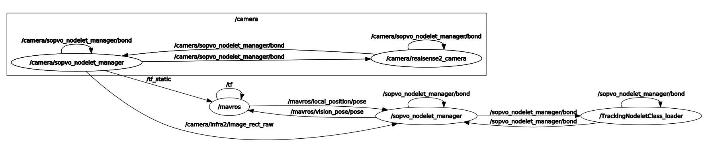

### PS: This is a UAV onboard version. For off-line testing, kindly check our main project here: 
https://github.com/arclab-hku/SOPVO

### Install (kinetic or melodic)
````
./install_sopvo_XXXX.sh

cd YOUR_WORK_SPACE

catkin_make
````

### Run demo (D435i)
UAV platform: lattepanda + D435i. Please install realsense-ros first.

````
roslaunch sopvo sopvo_d435i.launch

roslaunch sopvo px4.launch
````

You should see the results below:
 <br />
 <br />
 <br />

PS: the two axises shown in RVIZ are /mavros/vision_pose/pose (from sopvo) and /mavros/local_position/pose (from PX4 EKF), respectively. Please tuning your PX4 para, espectially EKF for better pose fusion performance.

### Maintainer:

Ran Duan, ArcLab at PolyU, HK, China
ran-sn.duan@connect.polyu.hk
rduan036@gmail.com
